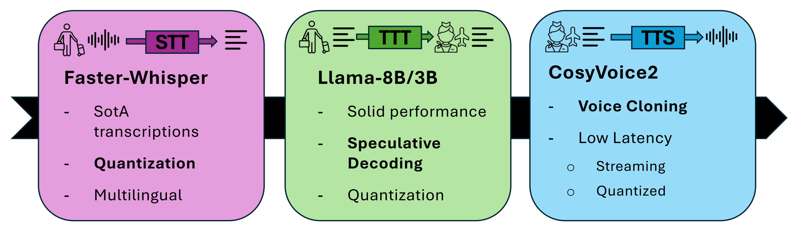
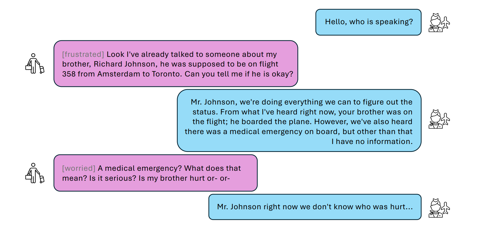
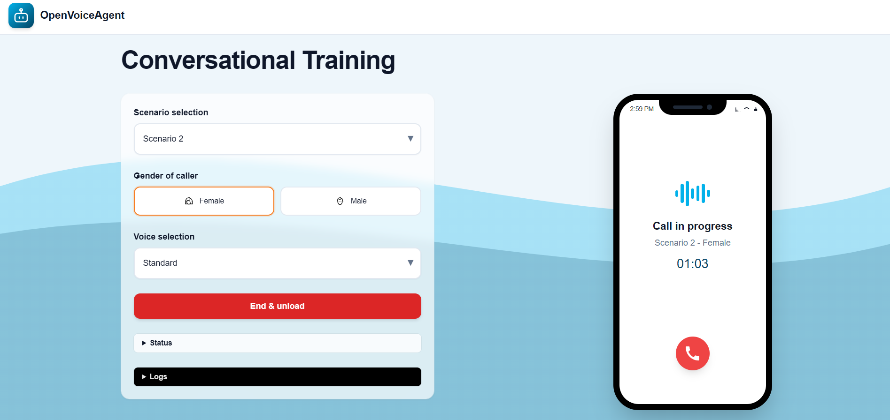
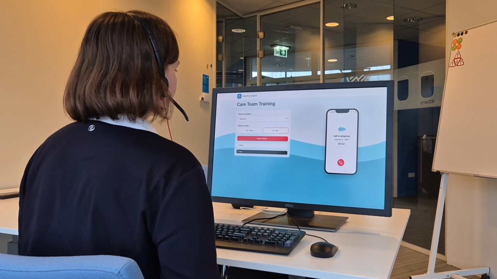
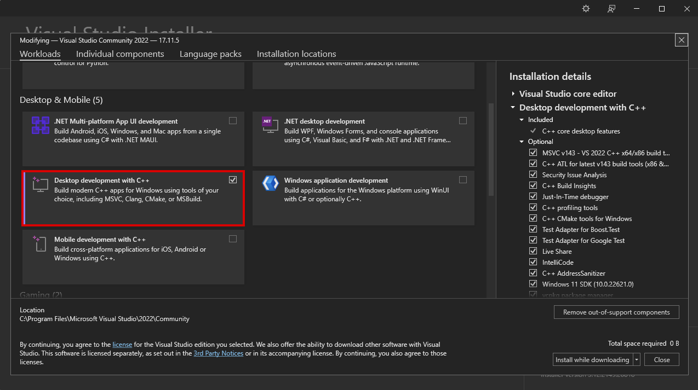
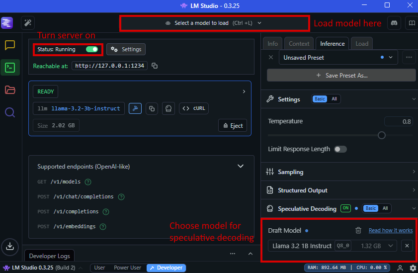

# OpenVoiceAgent: On-Premise Conversational AI for Realistic and Emotional Dialogue (for Joint Interdisciplanary Project @ KLM)


### _Delft University of Technology JIP 2025: KLM Next-Gen AI/XR Trainings_

Authors: Moniek Smink, Matteo Fregonara, Natanael Djajadi

In collaboration with: Siri Høystad, Sem Zeelenberg, Winnie Cheng, and Vassilis Varnas

## Overview

**OpenVoiceAgent** is a proof-of-concept conversational AI agent capable of handling **high-stakes training dialogues**.  
It integrates:
- **STT** (Speech-To-Text for speech recognition) - **Faster-Whisper**
- **TTT** (Text-to-Text using Large Language Models for text generation) - **Llama-3.2**
- **TTS** (Text-To-speech for speech synthesis) - **CozyVoice2**
- **Flask frontend** + multi-threaded pipeline

Developed as part of the TU Delft × KLM Joint Interdisciplinary Project (JIP) 2025. Download the full report (PDF) [here](docs/OpenVoiceAgent_Report.pdf).

### System Pipeline

Below is an overview of the full voice-interaction pipeline, including the rationale behind each chosen AI model:



### Key Features
- Fully **on-premise** (no external API calls after startup)
- **FasterWhisper** STT for low-latency speech recognition
- Local LLM inference via **LMStudio** (Llama-3.2 3/8B Instruct with 1B for speculative decoding)
- **CosyVoice2** TTS with voice cloning using reference emotion audio clips
- CLI and **Flask** frontend interface
- **Multi-threaded** real-time processing pipeline

#### Example Conversation 

Below is an example of a conversation generated by **OpenVoiceAgent**, illustrating how the agent responds during a high-stakes scenario.  
In the conversation view, **the right side represents the user** and **the left side represents the AI agent**.  
Each AI message begins with an **emotion tag** (e.g., `[frustrated]`, `[worried]`) generated by the **TTT model** to indicate the agent’s intended emotional tone.  
This emotion tag is then passed to the **TTS module**, which selects and synthesizes speech using the corresponding emotional voice sample.



#### Frontend Interface

The frontend interface is shown below. For usage instructions, refer to **Quickstart → Frontend Usage**.



#### Multithreading Overview

The system uses a **multi-threaded architecture** to manage simultaneous speech recognition, response generation, and voice synthesis.  

As shown below, the conversational pipeline runs across distinct threads for:
- **User Listener**: captures and transcribes user speech via the STT model.  
- **Response Generator**: processes transcribed text and produces agent responses using the TTT model.  
- **Response Voicer**: handles speech synthesis through two sub-threads:  
  - one generates emotional speech via the TTS model, and  
  - the other (**Response Player**) plays the generated speech output in real time.  

To ensure natural interaction, the **User Listener** thread can interrupt the other two threads at any time, allowing the user to speak over the agent, which enables realistic, human-like conversational control. 


### Demo Video (Click to Play)

[](https://www.youtube.com/watch?v=2EcDLaaYMCg)

## Quickstart
### Instructions

0. Install [Visual Studio Community](https://visualstudio.microsoft.com/free-developer-offers/) with 'Desktop development with C++'

    

2. Install a version of [Miniconda](https://repo.anaconda.com/miniconda/)

3. Initialize your environment (in Miniconda)

    ```
    conda create -n openvoiceagent python=3.10.9
    conda activate openvoiceagent
    ```

4. Clone this repository

    ```
    git clone https://github.com/mfregonara/OpenVoiceAgent.git
    cd OpenVoiceAgent
    ```

5. Install the required dependencies (assuming with GPU)

    ```
    pip install torch==2.3.1 torchvision==0.18.1 torchaudio==2.3.1 --index-url https://download.pytorch.org/whl/cu118
    pip install -r requirements.txt 
    conda install -c conda-forge ffmpeg=4.3.1 
    ```

    _Note: GPU recommended. CPU fallback works but is slower._

6. Install [LMStudio](https://lmstudio.ai/) and download the `Llama-3.2-8b-instruct`, `Llama-3.2-3b-instruct` and `Llama-3.2-1b-instruct` models

    

   _Note: Other LLMs can be switched in as desired but large LLMs increase the latency._

7. Set up the TTS model

    1. Initialize Submodules (including CosyVoice2) 
        ```
        git submodule update --init --recursive
        ```

    2. Navigate and Install Dependencies
        ```
        cd third_party/cosyvoice
        pip install -r requirements.txt -i https://mirrors.aliyun.com/pypi/simple/ --trusted-host=mirrors.aliyun.com
        ```

    3. Download Model Weights
        ```
        git clone https://www.modelscope.cn/iic/CosyVoice2-0.5B.git pretrained_models/CosyVoice2-0.5B
        ```

8. (Optional) Switch Torch versions if using a newer or high-end GPU (e.g., RTX 5090)
    ```
    pip uninstall torch torchvision torchaudio
    pip install torch==2.7.0 torchvision==0.22.0 torchaudio==2.7.0 --index-url https://download.pytorch.org/whl/cu128 
    ```

    _Note: switch out_ `cu128` _for the correct cuda runtime shown by_ `nvidia-smi`

9. Launch LMStudio

   - Load one of the supported models: `Llama-3.2-8b-instruct` or `Llama-3.2-3b-instruct`
   - For best real-time performance, use `Llama-3.2-1b-instruct` for speculative decoding under the `Inference` tab
   - Start the Local Inference Server (typically runs on `localhost:1234`)
   - Verify the server is active before launching the pipeline

10. Run application (two options)
    1. CLI: From command line with terminal intermediate outputs
        ```
        python main.py --prompt-file prompts/scenario_1/female_char/prompt.json --output-file outputs/example.txt --tts-config tts_config_cosyvoice.json --wavs-directory wavs/reference_woman/Standard
        ```

        - `prompt-file`: points to the JSON file containing the system prompt to the LLM (explained more in **Customization → Adding Your Own Prompts**)
        - `output-file`: points to the txt file that will contain the final transcription after the pipeline finishes
        - `tts-config`: points to the json file that contains the parameters for the tts engine
        - `wavs-directory`: points to the directory that contains the emotional voice samples (explained more in **Customization → Adding Your Own Voices**)

    2. Flask: With frontend without intermediate outputs
        1. Run `flask run` to start frontend server
        2. Open browser at `http://127.0.0.1:5000`
        3. Select scenario, gender, and voice → Click **Load Model**
        4. Logs appear in `outputs/web_log.txt`
        

## Repository Structure

```
.
├─ main.py                                   # Pipeline entry-point (CLI)
├─ app.py / templates / static               # Flask frontend                       
├─ prompts/                                  # Scenario prompts
│  ├─ Scenario_1/
│  │  ├─ female_char/prompt.json
│  │  └─ male_char/prompt.json
│  └─ Scenario_2/...
├─ wavs/                                     # Emotion voice references
│  ├─ reference_woman/Standard/...
│  └─ reference_man/Standard/...
├─ llm_lmstudio/                             # LLM Handler
├─ tts_handler_cosyvoice.py                  # TTS Handler
├─ tts_config_cosyvoice.json                 # TTS Handler config file
├─ realtimetts_clone/                       
│  └─ engines/...                            # TTS engine files
├─ third_party/
│  ├─ CosyVoice/                             # TTS model submodule
│  │  └─ pretrained_models/CosyVoice2-0.5B   # TTS model weights (downloaded from ModelScope)
│  └─ pengzhendong/wetext/                   # Python text-processing submodule
├─ requirements.txt
└─ outputs/

```

### Saved Files

The `outputs/` directory stores all logs and transcriptions generated during runtime.

- **web_log.txt**: created automatically when running the **Flask frontend**.  
  Contains real-time logging of system events, model responses, and errors.

- **Transcripts (CLI mode)**: saved according to the path set in `--output-file`.  
  In the Quickstart example, this is `outputs/example.txt`.

- **Transcripts (Frontend mode)**: automatically saved under: `outputs/{selected_scenario}_{selected_gender}_{selected_voice}_{timestamp}.txt`


## Customization

### Adding Your Own Prompts

Each prompt defines a training scenario and lives in `prompts/`:

```
prompts/
└─ Scenario_{N}/
   ├─ female_char/prompt.json
   └─ male_char/prompt.json
```

An example of `prompt.json`

```
{
    "char": "Miss Johnson",
    "user": "KLM care team member",
    "system_prompt": "You are {char}, a 31-year-old woman, worried and angry about her missing brother. Do not act like an AI. [..]"
}
```

Prompts are dynamically loaded by the frontend dropdowns. The folder name (`Scenario_{N}`) can be customized and will appear changed in the frontend.

### Adding Your Own Voices

Add new voice reference samples **with their matching transcriptions** under `wavs/`:

```
wavs/
└─ reference_{woman|man}/
   └─ <VariantName>/
      ├─ {emotion_1}.txt
      ├─ {emotion_1}.wav
      ├─ {emotion_2}.txt
      ├─ {emotion_2}.wav
      └─ ...
```

Keep filenames simple and descriptive, such as `angry.wav` / `angry.txt`, since these filenames represent the **emotions** the LLM can select from. It is recommended to choose your emotion set based on the [Emotion Typology](https://emotiontypology.com/), a well-structured reference of 60 human emotions for consistent labeling.


**Recommended audio requirements**
- `.wav` format  
- **16 kHz** sample rate (CosyVoice2 automatically downsamples higher rates)  
- **Mono** or **stereo** both accepted  
- Typical **16-bit PCM** (default for most recorders)  
- Each clip: 3 - 10 seconds of clear speech  
- Avoid background noise, music, or long silences

**Transcription guidelines**
- The text should **exactly match** what is said word for word, including punctuation (`,`, `.`, `?`, `!`).
- Use **consistent casing** e.g., uppercase letters for shouted words if that reflects tone.
- Avoid extra spaces, emojis, or unspoken annotations.
- If the audio includes hesitation sounds (`uh`, `um`), or expressions like `wow`, include them in the text too.

**Warning:** Mismatched or inaccurate transcripts can reduce TTS quality and voice consistency.

## Supported Environments

| Component | Tested Version                                  |
| --------- | ---------------------------                     |
| OS        | Windows 11                                      |
| Python    | 3.10.9                                          |
| GPU       | RTX 3080/4070 (slow), RTX 4090/5090 (optimal)   |
| STT       | FasterWhisper - Tiny.en, Small.en     |
| TTT/LLM   | LM Studio - Llama 3.2 1B/3B/8B        |
| TTS       | CosyVoice2 0.5B                        |


## Troubleshooting

If you encounter errors, follow these steps to resolve them.

---

#### `RealTimeSTT: root - ERROR - Library cublas64_12.dll is not found or cannot be loaded`

This error means a required NVIDIA library is missing. To fix this, you need to download and install the cuDNN library.

1.  Go to the official **NVIDIA cuDNN downloads** page: [https://developer.nvidia.com/cudnn-downloads](https://developer.nvidia.com/cudnn-downloads)
2.  Download the appropriate version.
3.  Once downloaded, copy the files from the `bin` folder of your cuDNN installation (e.g., `C:\Program Files\NVIDIA\CUDNN\v9.13\bin\12.9`) and paste them into your Conda environment's library bin folder.

    **Example Path:**
    `C:\Users\<your_username>\miniconda3\envs\<your_env_name>\Library\bin`

---

#### `RealTimeSTT: root - ERROR - cuDNN failed with status CUDNN_STATUS_EXECUTION_FAILED`

This error often indicates a **GPU memory issue**. The GPU may not have enough free memory to run the process.

**Solution:** Check your GPU's memory usage and close any other applications that might be using it. You can use a tool like `nvidia-smi` to monitor GPU memory.

If your GPU memory is truly empty, you may need to install the CPU version of PyTorch as a fallback. Run the following command:

```bash
pip install torch==2.3.1 torchvision==0.18.1 torchaudio==2.3.1 --index-url https://download.pytorch.org/whl/cpu
```

---

#### `HTTPConnectionPool(host='localhost', port=1234): Max retries exceeded`

This error indicates that the application is trying to connect to a server that is not running.

**Solution:** If you are using **LM Studio**, make sure you have loaded a model and started the local inference server. You can find the button to start the server in the **Local Server** tab of the LM Studio application.

---

#### `Could not locate cudnn_ops64_9.dll. Please make sure it is in your library path!`

**Solution:** Run command.

```
pip install "nvidia-cuda-runtime-cu12" "nvidia-cublas-cu12" "nvidia-cudnn-cu12==9.*" "nvidia-cuda-nvrtc-cu12"
```

## License

This project is released under the **Apache License 2.0**.  
Refer to the [`LICENSE`](LICENSE) file for details.  
Components such as **CosyVoice2**, **FasterWhisper**, and **Llama** have their respective licenses.

## Acknowledgements

- **KLM Royal Dutch Airlines**  
- **TU Delft Joint Interdisciplinary Project (JIP) 2025**  
- Open-source frameworks powering this project: **FasterWhisper**, **CosyVoice2**, **LMStudio**, **PyTorch**, and **Meta Llama**

## Citation

If you use our work in your research, please cite us.

```
@misc{mnm2025openvoiceagent,
    title={OpenVoiceAgent: On-Premise Conversational AI for Realistic and Emotional Dialogue},
    author={Smink, Moniek and Fregonara, Matteo and Djajadi, Natanael},
    howpublished = {\url{https://github.com/mfregonara/OpenVoiceAgent}},
    year={2025},
}
```
